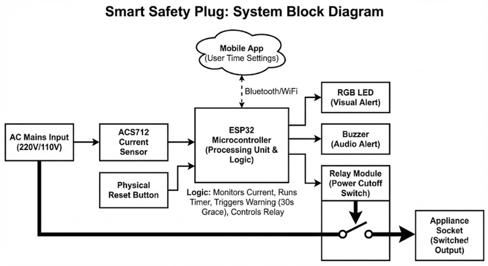

# ⚡ SafeSocket: The Intelligent Fire Prevention System

<div align="center">
<i>Real-time power monitoring and safety analytics dashboard.</i>
</div>

---

## 📜 Problem Statement

Household fires caused by forgotten heating appliances (Irons, Soldering Stations, Geysers, Hair Straighteners) are a major cause of residential accidents.  
Most smart plugs only allow remote control, but **lack autonomous safety logic**. If you forget to check your phone, you're still at risk.

---

## 💡 The Solution: SafeSocket

SafeSocket is a **Human-in-the-Loop** safety device that retrofits existing appliances.

It monitors real-time electrical current patterns to detect *Idle High-Load States* and:

- **Detects** high current (>200mA) for unsafe durations (e.g., 15 minutes)  
- **Warns** users through a buzzer + LED  
- **Acts** by physically cutting AC power if no reset button is pressed  

---

## 🚀 Key Features

### 🔌 Hardware (Embedded System)
- **Active Load Monitoring:** ACS712 Hall-Effect sensor for RMS current  
- **Failsafe Relay Logic:** Mechanical relay isolates high voltage after cutoff  
- **Offline Autonomy:** Safety logic runs locally on the ESP32  
- **Manual Override:** Physical button to reset the safety timer  

### 💻 Software (Analytics Dashboard)
- **Real-Time Visualization:** AJAX-based live updates without reloads  
- **Historical Analytics:** SQLite logs + Chart.js graphs  
- **Responsive UI:** Dark-mode dashboard for all devices  

---

## 🏗️ System Architecture & Logic Flow

SafeSocket uses a full-stack IoT design with edge processing + backend + dashboard.

---

### 1. High-Level Data Flow

The ESP32 collects sensor data, makes safety decisions locally, and syncs with the Python backend for logging.

<div align="center">

</div>

---

### 2. Hardware Block Diagram

ACS712 measures current → Relay performs cutoff → ESP32 handles logic + communication.

<div align="center">

</div>

---

### 3. Detailed Logic & Architecture

The system consists of:

- **Hardware Edge:** Sensor reading → Threshold check → Cutoff  
- **Server:** Data logging + Watts calculation  
- **Dashboard:** Real-time visual monitoring  

<div align="center">

</div>

---

## 🛠️ Tech Stack & Bill of Materials

| Component / Tech | Description |
|------------------|-------------|
| **Microcontroller** | ESP32 Dev Module |
| **Sensor** | ACS712-20A Hall Effect Sensor |
| **Actuator** | 5V Relay Module |
| **Feedback** | Buzzer + LED |
| **Backend** | Python (Flask), SQLite3 |
| **Frontend** | HTML5, CSS3, JS, Chart.js |
| **Protocol** | HTTP REST API |

---

## ⚙️ Pinout & Wiring Configuration

⚠️ **WARNING: High-voltage AC (220V). Extreme caution required.**

### **Low Voltage Logic (ESP32 Connections)**

| Component Pin | ESP32 Pin | Function |
|---------------|-----------|----------|
| ACS712 OUT | GPIO 34 | Analog Current Reading |
| Relay IN | GPIO 26 | Relay Trigger |
| Buzzer (+) | GPIO 27 | Audio Alert |
| LED Anode | GPIO 14 | Visual Alert |
| Button | GPIO 33 | Reset Input |
| VCC / GND | VIN / GND | Power Rail |

### **High Voltage Loop (Series Connection)**  
```
Wall Plug (Live) → ACS712 → Relay → Output Socket → Appliance
```

---

## 📥 Installation & Setup

### **1. Hardware Setup**
- Flash `firmware.ino` onto the ESP32  
- Update:
  - `ssid` (WiFi name)
  - `password` (WiFi password)
  - `serverUrl` (your laptop IP)

### **2. Software Setup (Dashboard)**

```bash
# Clone repository
git clone https://github.com/yourusername/safesocket.git
cd safesocket

# Install dependencies
pip install flask

# Run the server
python app.py
```

### **3. Usage**

1. Ensure laptop + ESP32 are on the **same WiFi**
2. Ensure firewall is OFF on your laptop for port 5000  
3. Open: **http://localhost:5000**  
4. Plug in SafeSocket → Dashboard updates automatically  

---

## 📊 How It Works (State Machine)

- **IDLE:** Load < 0.2A — System resting  
- **ACTIVE:** Load > 0.2A — Timer starts  
- **WARNING:** Timer limit exceeded — LED+Buzzer notify user  
- **CUTOFF:** No reset pressed — Relay OFF  

---

## 🔮 Future Roadmap (VLSI Integration)

- Custom PCB for compact housing  
- FPGA/ASIC-based safety timer  
- ML-based appliance recognition  

---

## 📄 License

Released under the **MIT License**.
